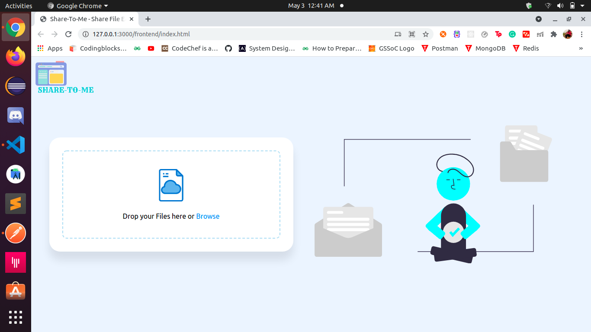
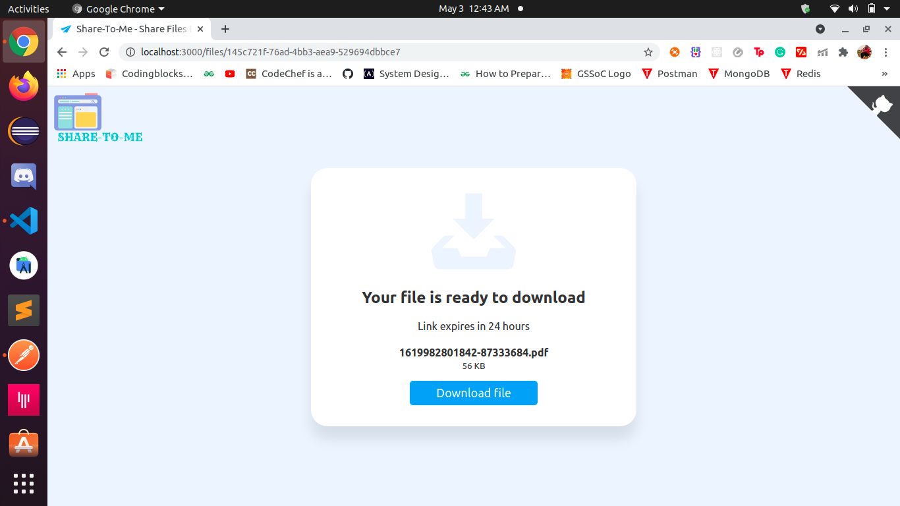
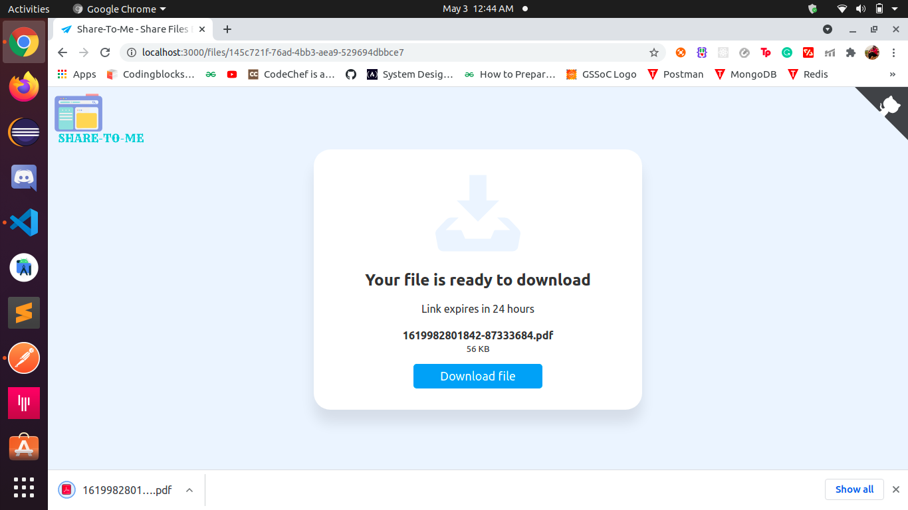
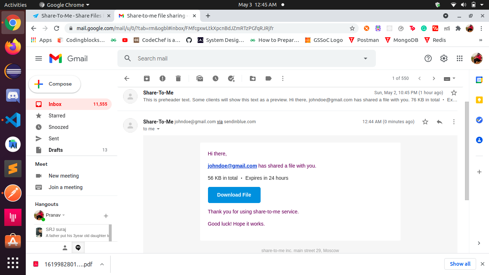

# SHARE-TO-ME A File Sharing Web Application 

## List of Features in this App

1. Adding drag drop feature
2. Copy link to clipboard
3. Creating toast alert
4. Adding file limit & size limit
5. File upload api in Node Js  
6. Multer package integration
7. Download file from Node Js server
8. Send emails using node Js ( express Js ) 

## Workflow of App through ss 

## Next

## Next

## Next

## End

## Installation Instruction

1. Fork the project
2. Clone the project
3. Go to backend directory and run `yarn add` or `npm i`
4. Add .env file and add following details
- MONGO_CONNECTION_URL
- APP_BASE_URL
- SMTP_HOST
- SMTP_PORT = 587
- MAIL_USER 
- MAIL_PASSWORD
4. Run backend at port 3000 with command `yarn dev`
5. Run frontend by using live server of your code editor

## Leave a * if you liked the project

